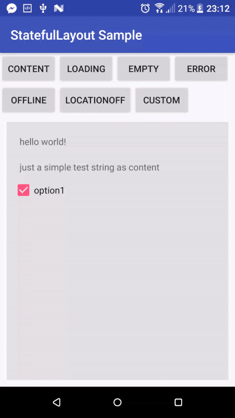

## StatefulLayout

[](https://android-arsenal.com/details/1/5325)  [](https://android-arsenal.com/api?level=14)  [](https://jitpack.io/#gturedi/StatefulLayout)  [](https://travis-ci.org/gturedi/StatefulLayout)  [](http://www.apache.org/licenses/LICENSE-2.0.html)

Android layout to show most common state templates like loading, empty, error etc. To do that all you need to is wrap 
the target area(view) with StatefulLayout.



## Usage
Add dependecy to gradle
```groovy
repositories {
    maven {
        url "https://jitpack.io"
    }
}

dependencies {
     compile 'com.github.gturedi:StatefulLayout:master-SNAPSHOT'
}
```

Then wrap a view which target area(view) to show states with StatefulLayout
```xml
  <com.gturedi.views.StatefulLayout
        android:id="@+id/stateful"
        android:layout_width="match_parent"
        android:layout_height="match_parent"
        >
    
        <!-- your content here  -->
        <LinearLayout
            android:id="@+id/target"
            android:layout_width="wrap_content"
            android:layout_height="wrap_content"
            app:stfAnimationEnabled="true"
            app:stfInAnimation="@android:anim/slide_in_left"
            app:stfOutAnimation="@android:anim/slide_out_right"
            >
            ...
        </LinearLayout>

    </com.gturedi.views.StatefulLayout>
```

Finally in your activity/fragment get StatefulLayout reference and call showXXX methods
```java
StatefulLayout stateful = (StatefulLayout) findViewById(R.id.stateful);
stateful.showLoading();
//stateful.showEmpty(getString(R.string.testMessage));
//stateful.showError(getString(R.string.testMessage), clickListener);
//etc.
```

## API
State methods have overloads for customization. If you pass clickListener parameter as null, relevant state button 
will be hided. More customization please look [CustomStateOptions.java](library/src/main/java/com/gturedi/views/CustomStateOptions.java)

- setAnimationEnabled(boolean animationEnabled)
- setInAnimation(@AnimRes int inAnimation)
- setOutAnimation(@AnimRes int outAnimation)
- showContent()
- showLoading(String message)
- showEmpty(String message)
- showError(String message, OnClickListener clickListener)
- showOffline(String message, OnClickListener clickListener)
- showLocationOff(String message, OnClickListener clickListener)
- showCustom(CustomStateOptions options)

## Customization
Just override relevant resource in your app to customize state views appearance

- To Override **strings** [strings.xml variables](library/src/main/res/values/strings.xml)

- To Override **styles** [styles.xml](library/src/main/res/values/styles.xml)

- To Override **layout** [stateful_layout.xml](library/src/main/res/layout/stateful_layout.xml)

## License
    Copyright 2017 Gökhan Türedi (turedi.gokhan@gmail.com)
    
    Licensed under the Apache License, Version 2.0 (the "License");
    you may not use this file except in compliance with the License.
    You may obtain a copy of the License at
    
      http://www.apache.org/licenses/LICENSE-2.0
    
    Unless required by applicable law or agreed to in writing, software
    distributed under the License is distributed on an "AS IS" BASIS,
    WITHOUT WARRANTIES OR CONDITIONS OF ANY KIND, either express or implied.
    See the License for the specific language governing permissions and
    limitations under the License.